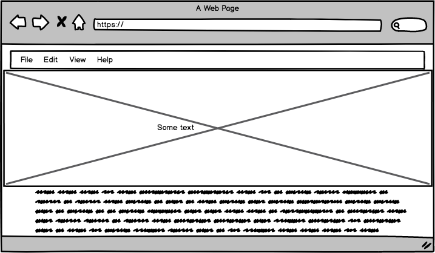
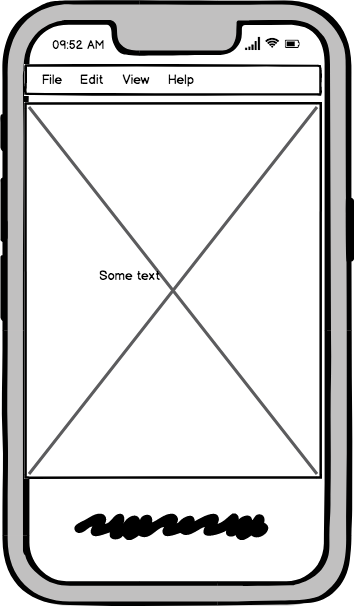
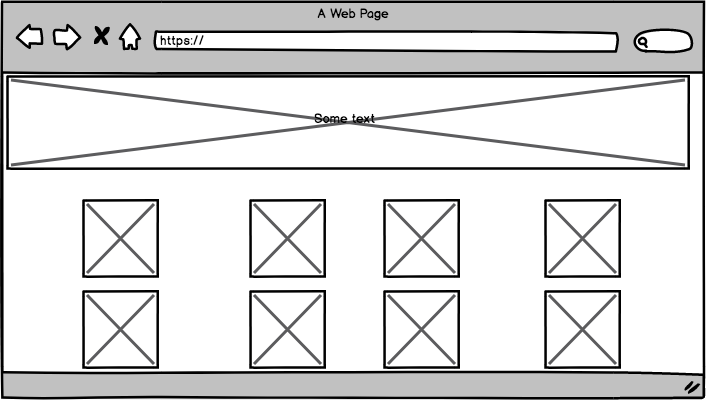
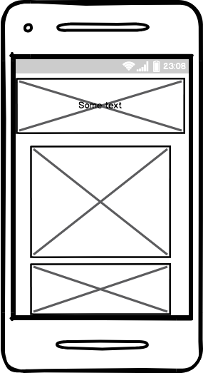

<h1>Milestone Project 1</h1>

The aim of this first Milestone project is to reuse the technologies covered in the the first part of the Code Insitute's Full Stack Web developer course, such as HTML, CSS and Bootstrap.
For my project I chose to create a website to display some of the most recent artwork of a painter (also my dad!) and provide a contact form for potential buyers (even though the site does not actually include any back-end functionality).

<h2>UX</h2>
I wanted my design to be simple, intuitive and discreet so that a user's attention is drawn to the artwork itself rather than the site's design. Therefore I opted for a black and white background image, with transparent navbar and footer.
The site is made up of 5 pages, the landing page, 2 galleries (1 for watercolours, 1 for acrylics), a timeline of past exhibitions and a contact page. I used one font called "Dosis" throughout the site as I thought its soft rounded edges suited the nature of this site, it's rather informal and unobstrusive.
The 3 main pages are built around the same design, a jumbotron displaying some artwork and titles cover the major part of the viewport and the user is encouraged to scroll down, as the introductory text (on the landing page) and the galleries are only partly displayed. The site is responsive and the same effect occurs on mobile devices and larger devices. The artwork itself is primarily displayed through thumbnail images, a larger image then opens onto a separate tab.
Although, not the most elegant of solutions to display the larger pictures, is was the only one that was technically accesible for me at this stage, I did try to use modals or lightboxes, rather unsuccessfully! This is one aspect that I would like to go back to in the future when I continue to develop this site.

<h2>Features</h2>

*The Landing page*

The user is presented with a navbar a jumbotron a text section, links to the galleries and a footer. The Jumbotron gives a taste of the artwork, whilst displaying the artist name and the series title clearly. The text section (in French) presents the user with the artistic concept of this series, and the two pictures are links to the galleries, the user is informed of this by the pointer and the slight colour change of the image card on hover.
The footer provides some basic information, a downloadable item (a price list, in reality just a blank document), and links to social media (empty links), again the user is informed of the clickable nature of these elements on hover.

*The galleries*

The user returns to the familiar structure that he experienced on the landing page, but this time is presented with two colourful galleries of acrylics and watercolours.

*The past exhibition page*
Allows the user to have an overview of the artist's career as they scroll down the timeline.

*The contact page*

Allows the user to send an email to the painter if they are interested in some of the work presented on the site.

Wireframes for landing pages and galleries:

<h2>Technologies and support used</h2>

*GitHub
*Balsamiq (wireframes)
*GitPod (IDE)
*HTML (structure)
*CSS (style)
*Bootstrap (navbar, grid structure, form)
*Font Awesome (icons)
*Google Fonts (Dosis)
*W3schools (support for bits of code)
*Slack and Stackoverflow (general technical support)
*Freeformatter (code formatting)
*CSS color code (colour picking)
*Pixabay (copyright free images)
*Nu HTML checker (code validation)

<h2>Testing and bugs</h2>

I have tested the site on a various devices (Android and Apple phones, Ipad, Laptops) as well as various browsers (Safari, Chrome, Firefox), I have asked various users to test the site, using the github link.
The site works and looks fairly consistently accross the board. 
The main issue that I had was with the image display of the Jumbotron on Apple phones and tablets, which seem to interpret the CSS "cover" differently to other devices.

<h2>Deployment</h2>

I used GitPod as is works well in tandem with Git Hub and it's easy to go from one to the other. I installed the GitPod Chrome add-on, and was able to create the repository in Git Hub and work straightaway on my site in Git Pod. I then used the terminal (git add-commit-push) to commit my work to Git Hub.
For the remote deployment in  Git Hub, I:

*Selected the milestone-project-1 from my GitHub dashboard.
*Selected 'Settings' from the menu bar.
*Chose 'master branch' from the dropdown menu.
*Link to website was created

https://raphaelmar.github.io/Milestone-project-1/

*For deploying the site locally:
*Go to main page of repository (Milestone-project-1)
*Click clone or download
*Copy the displayed url
*Open terminal
*Yype git clone
*Paste url then press enter

<h2>credits</h2>
Background image from Pixmania, all other images used with the permission of Daniel Maringue
All text and information provided with the permission of Daniel Maringue

<h2>Copied code</h2>
Some code reused and adapted from previous lessons in the course (Whiskey project and resume project).
Bootstrap documentation and W3schools.

Acknowledgements
*To my mentor Reuben Ferrante for his time and help.
*To the Code Institute support team for their regular phone calls to keep me on track.
